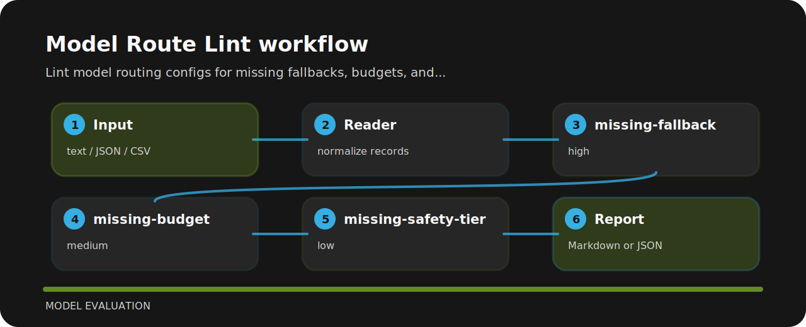

# Model Route Lint


## What it protects

Lint model routing configs for missing fallbacks, budgets, and safety tiers. It keeps the review small: one input file, a short list of findings, and enough context to fix the line that caused the warning.

| Detail | Value |
| --- | --- |
| Area | model evaluation |
| Entry | `model-route-lint` |
| Input | plain text |
| Output | terminal findings, optional JSON |

## Inspection line



| Signal | Level | What it flags | Fix direction |
| --- | --- | --- | --- |
| `missing-fallback` | high | model route has no fallback | Add a fallback model or explicit degraded-mode behavior. |
| `missing-budget` | medium | route budget control is missing | Set a max cost or token budget for the route. |
| `missing-safety-tier` | low | safety tier is not declared | Declare safety posture for this model path. |

## Command path

```bash
git clone https://github.com/mertefekurt/model-route-lint.git
cd model-route-lint
python -m pip install -e ".[dev]"
model-route-lint examples/sample.txt
```
