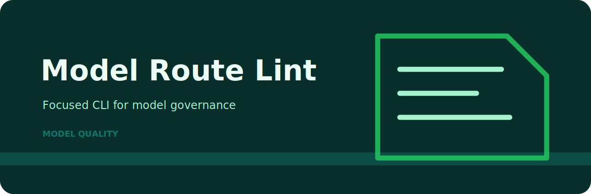

# Model Route Lint

Lint model routing configs for missing fallbacks, budgets, and safety tiers. The idea is simple: give Model Route Lint the local file or fixture, get a readable result, and decide what needs attention before the next handoff.

## Project card



| Detail | Value |
| --- | --- |
| Area | model quality |
| Command | `model-route-lint` |
| Example | `examples/sample.txt` |

## What would make me stop a review

| Stopper | Level | Why it matters |
| --- | --- | --- |
| `missing-fallback` | high | model route has no fallback |
| `missing-budget` | medium | route budget control is missing |
| `missing-safety-tier` | low | safety tier is not declared |

## Run from a fresh clone

```bash
git clone https://github.com/mertefekurt/model-route-lint.git
cd model-route-lint
python -m venv .venv
source .venv/bin/activate
python -m pip install -e ".[dev]"
model-route-lint examples/sample.txt
model-route-lint examples/sample.txt --json
```
